# PDF RAG Application 📚

A production-ready Retrieval-Augmented Generation (RAG) application for chatting with PDF documents. Built with **FastAPI**, **Streamlit**, **LangChain**, **Qdrant**, and **Google Gemini**.

---

## 🚀 Features

- **PDF Ingestion**: Upload and index PDF documents with automatic chunking.
- **Vector Search**: High-performance similarity search using Qdrant.
- **AI Chat**: Chat with your documents using Google's Gemini 1.5 Flash model.
- **Citations**: Every answer includes precise citations with page numbers and source files.
- **Session Management**: Create multiple chat sessions and switch between them.
- **Persistent History**: All chats and documents are stored in PostgreSQL.
- **Clean Architecture**: Separation of concerns with distinct Indexing and Chat services.

---

## 🛠️ Tech Stack

- **Backend**: FastAPI, Python 3.11
- **Frontend**: Streamlit
- **Database**: PostgreSQL (Metadata), Qdrant (Vectors)
- **LLM & Embeddings**: Google Gemini (via LangChain)
- **Infrastructure**: Docker Compose

---

## 🏁 Quick Start

### Prerequisites
- Docker & Docker Compose
- Google Gemini API Key

### 1. Clone & Configure
```bash
# Clone the repository
git clone <repo-url>
cd PDF_BEST_PRACTICE

# Create .env file
cp .env.example .env

# Edit .env and add your API key
# GEMINI_API_KEY=your_key_here
```

### 2. Run with Docker
```bash
# Start all services
docker compose build up -d

# Check logs
docker compose logs -f
```

### 3. Access the App
- **Frontend UI**: http://localhost:8501
- **Backend API**: http://localhost:8000/docs
- **Qdrant Dashboard**: http://localhost:6333/dashboard

---

## 📸 Screenshots


### Chat Interface


### PDF Upload


## Settings


---

## 🏗️ Architecture

### System Overview

```mermaid
graph LR
    %% Styles
    classDef frontend fill:#e1f5fe,stroke:#01579b,stroke-width:2px,color:#000;
    classDef backend fill:#e8f5e9,stroke:#2e7d32,stroke-width:2px,color:#000;
    classDef db fill:#fff3e0,stroke:#ef6c00,stroke-width:2px,color:#000;
    classDef external fill:#f3e5f5,stroke:#7b1fa2,stroke-width:2px,color:#000;
    classDef user fill:#ffffff,stroke:#333,stroke-width:2px,color:#000;

    User([👤 User]) -->|Interacts| FE[💻 Streamlit Frontend]
    
    subgraph Docker["🐳 Docker Compose Network"]
        direction LR
        FE -->|HTTP / JSON| BE[⚙️ FastAPI Backend]
        
        BE <-->|Metadata| DB[(🐘 PostgreSQL)]
        BE <-->|Vectors| VecDB[(🚀 Qdrant)]
    end
    
    BE <-->|Embeddings & Chat| LLM[✨ Google Gemini API]

    %% Apply Styles
    class User user;
    class FE frontend;
    class BE backend;
    class DB,VecDB db;
    class LLM external;
```



### Services
1.  **Indexing Service** (`indexing_service.py`): Handles PDF loading, splitting, and indexing.
2.  **Chat Service** (`chat_service.py`): Handles retrieval and generation.

### Database Schema
- **users**: User accounts
- **sessions**: Chat sessions
- **documents**: PDF metadata
- **messages**: Chat history
- **metrics**: Performance tracking

---

## 🧪 Testing

### Verify Services
```bash
docker compose ps
```

### Check Backend Health
```bash
curl http://localhost:8000/health
```

---

